<div align="center">


# NER-SHIELD

### AI-Powered Landslide Risk Intelligence, Early Warning & Emergency Response Platform

**Predict → Explain → Simulate → Prioritize → Respond**

<br />


<br /><br />


<br />

<table>
<tr>
<td align="center" width="20%"><b>🔮<br />PREDICT</b><br /><sub>Spatial & temporal<br />landslide risk</sub></td>
<td align="center" width="20%"><b>🔬<br />EXPLAIN</b><br /><sub>Contributing factors<br />& confidence</sub></td>
<td align="center" width="20%"><b>🧪<br />SIMULATE</b><br /><sub>What-if scenario<br />analysis</sub></td>
<td align="center" width="20%"><b>🎯<br />PRIORITIZE</b><br /><sub>Exposure-ranked<br />response</sub></td>
<td align="center" width="20%"><b>🚨<br />RESPOND</b><br /><sub>Multilingual<br />early warning</sub></td>
</tr>
</table>

</div>

---

<details>
<summary><b>📑 Table of Contents</b></summary>

- [1. Overview](#1-overview)
- [2. Problem Statement](#2-problem-statement)
- [3. Vision & Core Loop](#3-vision--core-loop)
- [4. Objectives](#4-objectives)
- [5. Key Features](#5-key-features)
- [6. System Architecture](#6-system-architecture)
- [7. Data Strategy](#7-data-strategy)
- [8. Risk Intelligence Workflow](#8-risk-intelligence-workflow)
- [9. Offline-First Field Operations](#9-offline-first-field-operations)
- [10. Explainable Risk](#10-explainable-risk)
- [11. What-If Simulation](#11-what-if-simulation)
- [12. Technology Stack](#12-technology-stack)
- [13. GIS Map Architecture](#13-gis-map-architecture)
- [14. User Roles](#14-user-roles)
- [15. Security & Privacy](#15-security--privacy)
- [16. Reliability & Resilience](#16-reliability--resilience)
- [17. Testing & Validation](#17-testing--validation)
- [18. Project Structure](#18-project-structure)
- [19. Local Development](#19-local-development)
- [20. Environment Variables](#20-environment-variables)
- [21. Git Collaboration Workflow](#21-git-collaboration-workflow)
- [22. Development Phases](#22-development-phases)
- [23. Current vs Planned](#23-current-vs-planned)
- [24. SIH Demonstration Flow](#24-sih-demonstration-flow)
- [25. Limitations](#25-limitations)
- [26. Risks & Mitigation](#26-risks--mitigation)
- [27. Success Criteria](#27-success-criteria)
- [28. Team](#28-team)
- [29. License](#29-license)
- [30. Acknowledgement](#30-acknowledgement)

</details>

---

## 1. Overview

**NER-SHIELD** is an enterprise-style disaster intelligence and decision-support platform built for the **North Eastern Region (NER) of India**.

It fuses environmental, geospatial, satellite, terrain, historical, sensor and field-report evidence to estimate landslide risk, explain the contributing factors, assess potential impact, prioritize emergency response, and issue actionable warnings.

The goal is to move disaster management from **reactive reporting** toward **predictive, explainable and action-oriented intelligence**.

> [!IMPORTANT]
> NER-SHIELD is a **decision-support system**. It does not replace official emergency decisions and does not claim guaranteed prediction of every disaster event.

---

## 2. Problem Statement

The North Eastern Region is highly exposed to landslides, flash floods, road blockages and slope failures driven by heavy rainfall, fragile terrain and unplanned hill cutting.

<table>
<tr><th width="42%">Challenge</th><th>Operational Impact</th></tr>
<tr><td>Limited real-time prediction of landslide-prone zones</td><td>Warnings arrive after the event, not before</td></tr>
<tr><td>Fragmented weather, satellite, terrain, sensor and incident data</td><td>No single operational picture for decision-makers</td></tr>
<tr><td>Delayed identification of vulnerable slope changes</td><td>Deteriorating slopes go unnoticed until failure</td></tr>
<tr><td>Difficulty assessing impact on roads, villages and infrastructure</td><td>Response cannot be prioritized by exposure</td></tr>
<tr><td>Manual field reporting and weak connectivity in remote areas</td><td>Ground truth is slow, lossy or never reaches the centre</td></tr>
<tr><td>Raw model outputs without explanation</td><td>Authorities cannot justify or trust an alert</td></tr>
</table>

NER-SHIELD closes these gaps by combining **AI/ML + GIS + environmental intelligence + emergency-response workflows** in one platform.

---

## 3. Vision & Core Loop

> **Transform disaster management from reactive reporting into predictive, explainable and action-oriented intelligence.**

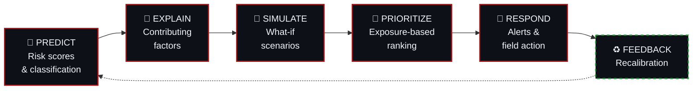

---

## 4. Objectives

<table>
<tr>
<td width="50%" valign="top">

- Create dynamic landslide risk maps
- Estimate spatial and temporal landslide risk
- Fuse satellite, environmental, terrain, sensor and field evidence
- Provide explainable risk factors and confidence
- Identify exposed roads, villages, bridges, schools and hospitals

</td>
<td width="50%" valign="top">

- Support what-if disaster scenarios
- Prioritize emergency response
- Provide multilingual and multi-channel alerts
- Support offline-first field operations
- Maintain secure role-based access and audit trails

</td>
</tr>
</table>

---

## 5. Key Features

<table>
<tr>
<td width="33%" valign="top" align="center">

### 🗺️
**GIS Command Center**

Centralized operational view: interactive MapLibre GL map with risk zones, terrain, rainfall overlays, roads, rivers, villages, schools, hospitals, bridges and live incidents — with layer controls and zone drill-down.

</td>
<td width="33%" valign="top" align="center">

### 🤖
**AI/ML Risk Intelligence**

Python service producing risk scores, classifications, contributing factors, confidence values, spatial predictions and temporal trends using Scikit-learn, XGBoost/LightGBM and PyTorch where required.

</td>
<td width="33%" valign="top" align="center">

### 🛰️
**Satellite & Change Analysis**

Satellite feature extraction, change analysis, evidence fusion and computer-vision-assisted field evidence for potential slope-change detection using OpenCV and Python geospatial tooling.

</td>
</tr>
<tr>
<td valign="top" align="center">

### 📍
**Incident & Field Reporting**

Geo-tagged reports carrying location, incident type, severity, observations, media, timestamp, status and the related risk zone — designed for remote terrain.

</td>
<td valign="top" align="center">

### 📡
**Offline-First Operations**

Capture in the field without connectivity, store locally, and synchronize automatically once the network returns. Field work never blocks on the network.

</td>
<td valign="top" align="center">

### 🚨
**Alerts & Early Warning**

Risk and incident escalation, multilingual alerts, multi-channel delivery, acknowledgement tracking and response escalation — always communicating uncertainty.

</td>
</tr>
<tr>
<td valign="top" align="center">

### 🏥
**Impact & Exposure**

Assesses roads, bridges, villages, schools, hospitals and critical infrastructure to answer: *what is at risk, and what do we respond to first?*

</td>
<td valign="top" align="center">

### 🔬
**Explainable Risk**

Never just `Risk = 87%`. Every score is decomposed into the drivers that produced it, with an explicit confidence indicator.

</td>
<td valign="top" align="center">

### 🧪
**What-If Simulation**

Explore consequences before acting: change rainfall assumptions and watch risk, exposure and response priority recompute.

</td>
</tr>
</table>

---

## 6. System Architecture

NER-SHIELD uses a layered architecture with **Spring Boot as the operational backend** and **Python as the specialized AI/ML engine**.

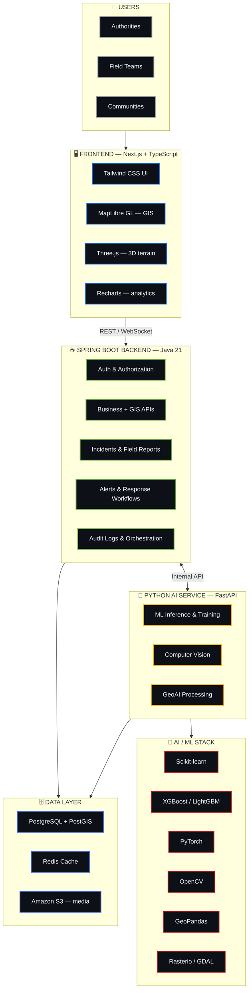

---

## 7. Data Strategy

NER-SHIELD is built around **multi-source evidence fusion** — no single feed is trusted alone.

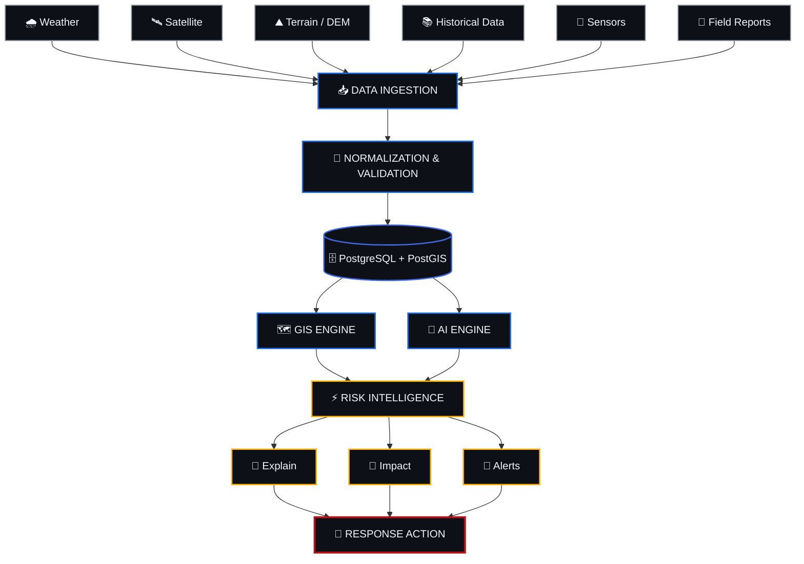

---

## 8. Risk Intelligence Workflow

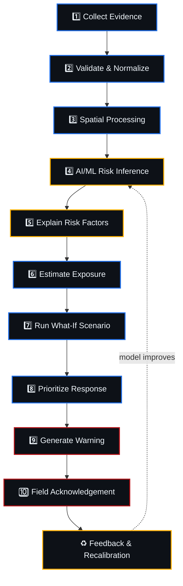

---

## 9. Offline-First Field Operations

Field operations continue even when connectivity does not.

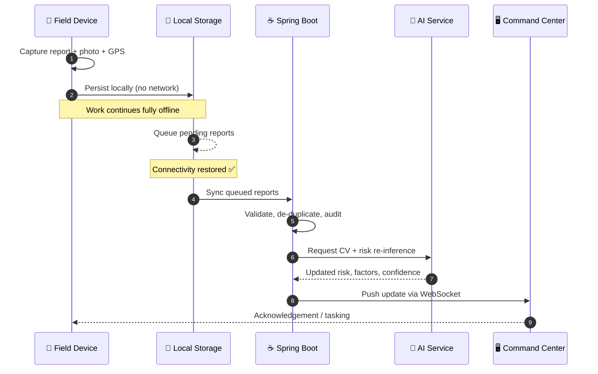

---

## 10. Explainable Risk

Instead of showing an opaque `Risk = 87%`, NER-SHIELD decomposes every score into its drivers.

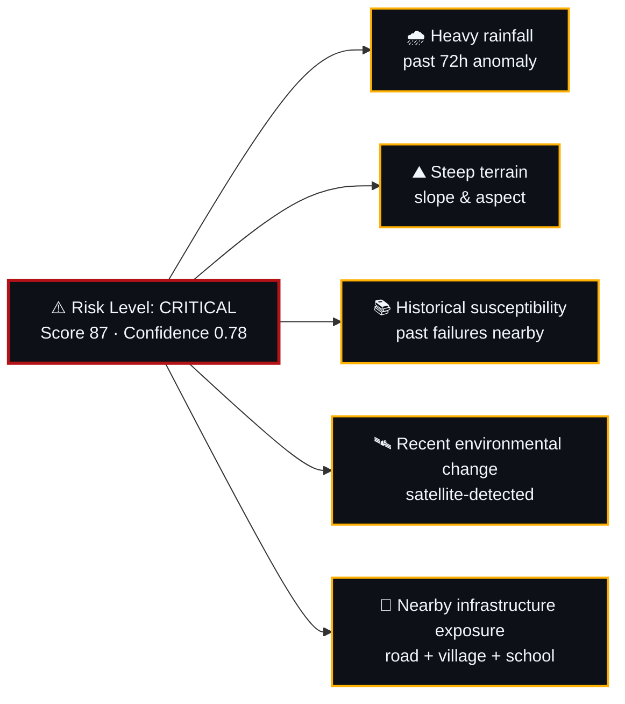

> [!NOTE]
> Confidence and uncertainty are surfaced alongside every prediction. AI output is presented as evidence, never as a guarantee.

---

## 11. What-If Simulation

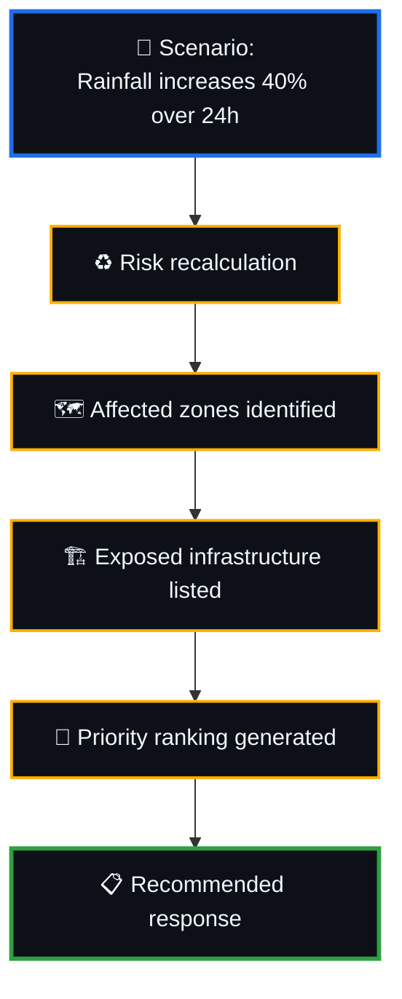

This lets decision-makers explore consequences **before** committing resources.

---

## 12. Technology Stack

<details open>
<summary><b>🖥️ Frontend</b></summary>
<br />

| Technology | Purpose | Version |
|:--|:--|:--|
| Next.js | Web application framework | `16.3.3` |
| React | UI architecture | `19.2.8` |
| TypeScript | Type-safe development | `5.x` |
| Tailwind CSS | UI styling | — |
| MapLibre GL | Interactive GIS map | `6.6.x` |
| Three.js | 3D graphics & terrain | `0.185.1` |
| React Three Fiber / Drei | React integration for Three.js | — |
| Framer Motion | UI animation and motion | `13.1.1` |
| Recharts | Charts and analytics | `3.10.1` |
| Lucide React | Interface icons | — |

> Exact installed patch versions should be read from `package-lock.json` when reproducing an environment.

</details>

<details>
<summary><b>☕ Core Backend</b></summary>
<br />

| Technology | Purpose |
|:--|:--|
| Java 21 | Core backend language |
| Spring Boot | Operational backend |
| Spring Security | Authentication and authorization |
| JWT / OAuth2 | Secure identity and access |
| Spring Data JPA | Persistence layer |
| REST APIs | Frontend/backend communication |
| WebSocket / STOMP | Real-time updates |

Spring Boot owns the main business and operational responsibilities.

</details>

<details>
<summary><b>🐍 AI / ML Service</b></summary>
<br />

| Technology | Purpose |
|:--|:--|
| Python | AI/ML service runtime |
| FastAPI | AI service API |
| Scikit-learn | Classical ML |
| XGBoost / LightGBM | Gradient-boosting models |
| PyTorch | Deep learning where required |
| OpenCV | Computer vision |
| GeoPandas | Vector geospatial analysis |
| Rasterio | Raster processing |
| GDAL | Geospatial data transformation |

Python is intentionally separated from the core backend so the ML ecosystem can evolve independently.

</details>

<details>
<summary><b>🗄️ Database & Geospatial</b></summary>
<br />

| Technology | Purpose |
|:--|:--|
| PostgreSQL | Primary relational database |
| PostGIS | Spatial / geographic data |
| Redis | Caching and fast-access state |
| GeoJSON | Risk zones and spatial feature data |
| Terrain DEM | Elevation and terrain visualization |

PostgreSQL + PostGIS is the central spatial data layer.

</details>

<details>
<summary><b>☁️ DevOps & Cloud</b></summary>
<br />

| Technology | Purpose |
|:--|:--|
| Docker | Containerization |
| Git / GitHub | Version control and collaboration |
| GitHub Actions | CI/CD |
| AWS | Cloud deployment target |
| Amazon S3 | Object and media storage |

Kafka or RabbitMQ may be introduced later if high-volume asynchronous processing justifies it.

</details>

---

## 13. GIS Map Architecture

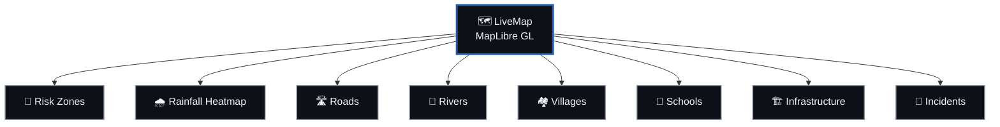

**Supported interactions:** layer visibility · zone selection · map recentering · smooth camera movement · risk visualization · incident visualization · terrain visualization · responsive resizing.

**Intended premium direction:** 3D terrain of Northeast India → risk zones → rainfall → incidents → infrastructure exposure → animated intelligence layers.

---

## 14. User Roles

| Role | Typical Responsibility |
|:--|:--|
| 🛠️ System Administrator | Platform configuration, users, integrations |
| 🏛️ Disaster Management Authority | Official decisions, alert approval |
| 🖥️ Command Center Operator | Live monitoring, incident triage, dispatch |
| 🚑 Field Response Team | Ground reporting, verification, response |
| 📊 Analyst | Model validation, historical analysis |
| 👤 Citizen / Community Reporter | Community-level incident reporting |

Permissions follow **least-privilege** principles.

---

## 15. Security & Privacy

<table>
<tr>
<td width="50%" valign="top">

- Role-based access control
- Authentication and authorization
- JWT / OAuth2
- API protection
- Rate limiting

</td>
<td width="50%" valign="top">

- Audit trails
- Secure secret management
- Minimal collection of citizen personal data
- No secrets committed to source control
- Controlled access to sensitive operational data

</td>
</tr>
</table>

---

## 16. Reliability & Resilience

Designed for environments where external services and connectivity fail.

- Offline-first field operations
- Last-known AI result when the AI service is unavailable
- Retry mechanisms and service-state visibility
- Caching and fallback data sources where applicable
- Explicit API failure handling
- Explicit uncertainty and confidence indicators

---

## 17. Testing & Validation

| Layer | Approach |
|:--|:--|
| **Backend** | JUnit · Mockito · Spring integration tests · API tests · security tests · Testcontainers |
| **Frontend** | Component testing · end-to-end testing · UI interaction testing |
| **AI/ML** | Precision · Recall · F1 · MAE · RMSE · false-alarm rate · missed-event rate · calibration · warning lead time · spatial and temporal validation |

> [!WARNING]
> AI performance claims should only be presented when backed by documented validation runs.

---

## 18. Project Structure

<details open>
<summary><b>Current frontend structure</b></summary>

```text
frontend/
│
├── app/                        # Next.js application routes
│
├── components/
│   └── map/
│       ├── CommandMap.tsx
│       ├── LayerControl.tsx
│       ├── LiveMap.tsx
│       ├── MapLegend.tsx
│       ├── PrimaryActions.tsx
│       └── ZoneDetailPanel.tsx
│
├── data/
│   ├── geo.ts
│   ├── incidents.ts
│   └── layers.ts
│
├── lib/                        # Shared application logic
├── types/                      # TypeScript types
└── package.json
```

</details>

<details>
<summary><b>Planned full-stack structure</b></summary>

```text
NER-SHIELD/
│
├── frontend/                   # Next.js + TypeScript
├── backend/                    # Spring Boot + Java 21
├── ai-service/                 # Python + FastAPI
├── database/                   # PostgreSQL + PostGIS
├── docker/                     # Docker configuration
└── docs/                       # Architecture / SRS / API docs
```

</details>

---

## 19. Local Development

**Requirements:** Node.js `20.9+` · npm · Git

```bash
# Install
cd frontend
npm install

# Run development server
npm run dev
```

| Target | URL |
|:--|:--|
| Frontend | `http://localhost:3000` |
| Command Center | `http://localhost:3000/command` |

```bash
npm run build     # Production build
npm start         # Start production server
npm run lint      # Lint
```

---

## 20. Environment Variables

> [!CAUTION]
> Never commit real credentials. Use `.env.local` for local frontend configuration and appropriate environment configuration for the backend and AI services.

```env
NEXT_PUBLIC_API_URL=
NEXT_PUBLIC_MAP_STYLE_URL=
API_URL=
AI_SERVICE_URL=
DATABASE_URL=
JWT_SECRET=
```

Only add variables the implementation actually requires.

---

## 21. Git Collaboration Workflow

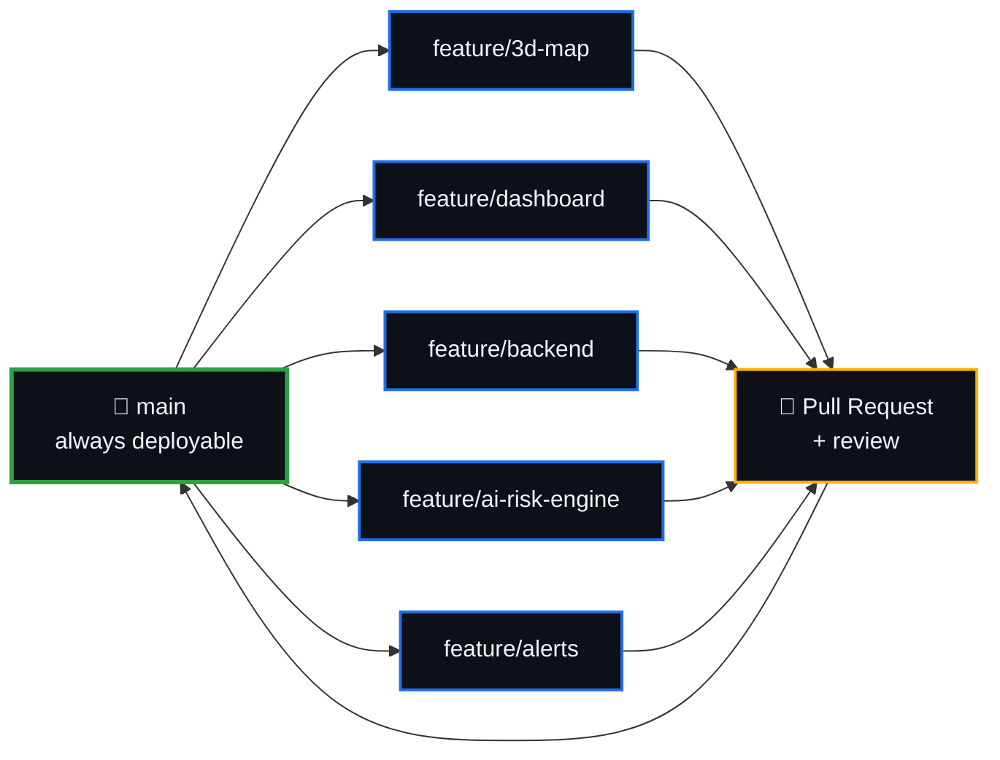

```bash
git checkout main
git pull origin main
git checkout -b feature/<feature-name>

git add .
git commit -m "feat: describe the change"
git push -u origin feature/<feature-name>
```

**Rules:** one branch per feature · no direct feature pushes to `main` · keep commits focused · pull latest `main` before major work · review every PR · avoid touching files owned by another feature · keep `main` stable.

---

## 22. Development Phases

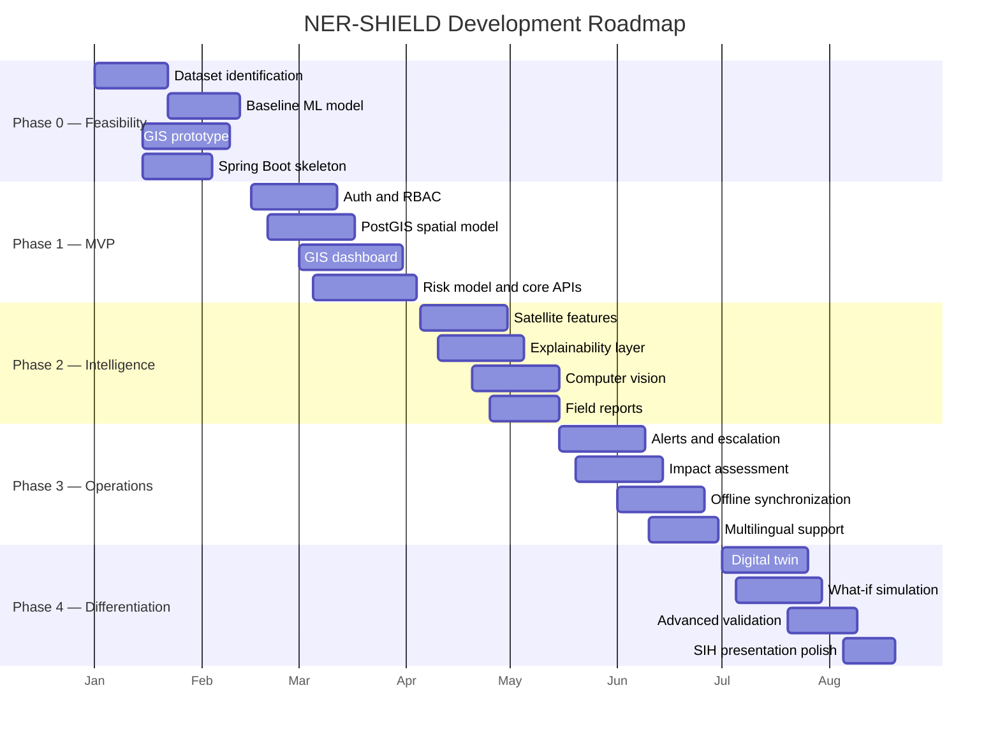

---

## 23. Current vs Planned

<table>
<tr>
<th width="33%">✅ Implemented</th>
<th width="33%">🎯 Architecture Target</th>
<th width="33%">🚀 Future Scope</th>
</tr>
<tr valign="top">
<td>

- Next.js frontend
- React + TypeScript
- Tailwind CSS
- MapLibre GL map
- GeoJSON risk zones
- Rainfall heatmap layer
- Roads, rivers, villages
- Schools, infrastructure
- Incident markers
- Layer visibility controls
- Risk-zone selection
- Map navigation
- Responsive resizing
- Three.js / R3F dependencies

</td>
<td>

- Java 21 + Spring Boot
- Spring Security
- JWT / OAuth2
- PostgreSQL + PostGIS
- Python + FastAPI service
- ML inference and training
- Computer vision
- Satellite analysis
- Redis caching
- WebSocket real-time
- Offline-first workflows
- Alert orchestration
- Docker + AWS
- GitHub Actions CI/CD

</td>
<td>

- Kafka / RabbitMQ for high-volume async
- GPU model serving where justified
- Drone imagery
- Multi-hazard intelligence
- Advanced digital twin
- Climate-risk forecasting
- Infrastructure vulnerability assessment
- Inter-agency integrations

</td>
</tr>
</table>

---

## 24. SIH Demonstration Flow

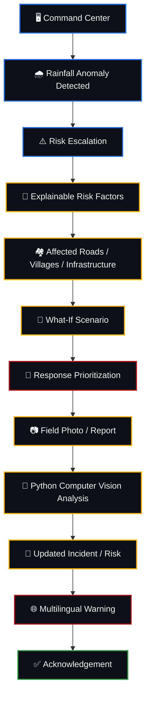

This walks the complete **Predict → Explain → Simulate → Prioritize → Respond** loop end to end.

---

## 25. Limitations

NER-SHIELD intentionally does **not** claim:

- ❌ Guaranteed prediction of every landslide
- ❌ Autonomous evacuation orders
- ❌ Fully autonomous drones
- ❌ Engineering-grade slope-stability certification
- ❌ Nationwide production deployment in the initial MVP

The platform assists authorized decision-makers. It does not replace them.

---

## 26. Risks & Mitigation

| Risk | Mitigation |
|:--|:--|
| Data scarcity | Multiple permitted sources, validation and explicit uncertainty |
| AI service unavailable | Last-known result, service-state indicator and retry |
| False alarms | Calibration, baselines and human verification |
| Missed events | Multi-source data fusion and escalation paths |
| Low connectivity | Offline-first field application |
| API downtime | Caching and fallback sources |
| Scope creep | MVP-first development |
| Backend complexity | Modular monolith before unnecessary microservices |
| Model overfitting | Spatial and temporal holdouts with baseline comparison |

---

## 27. Success Criteria

<table>
<tr>
<td width="50%" valign="top">

- ✅ Working Spring Boot core backend
- ✅ Secure APIs
- ✅ Working Python AI service
- ✅ PostgreSQL/PostGIS spatial model
- ✅ Operational GIS risk dashboard
- ✅ Measured AI validation
- ✅ Geo-tagged field reporting

</td>
<td width="50%" valign="top">

- ✅ Impact assessment
- ✅ Response prioritization
- ✅ Alert workflow
- ✅ Offline capture and synchronization
- ✅ At least one what-if scenario
- ✅ Docker/AWS deployment path
- ✅ Documented limitations & reproducible demo

</td>
</tr>
</table>

---

## 28. Team

<table align="center">
<tr><th colspan="2">👥 NER-SHIELD Team</th></tr>
<tr><td><b>Team Lead</b></td><td><i>Name</i></td></tr>
<tr><td><b>Member</b></td><td><i>Name</i></td></tr>
<tr><td><b>Member</b></td><td><i>Name</i></td></tr>
<tr><td><b>Member</b></td><td><i>Name</i></td></tr>
<tr><td><b>Member</b></td><td><i>Name</i></td></tr>
<tr><td><b>Member</b></td><td><i>Name</i></td></tr>
</table>

---

## 29. License

License to be finalized by the team. Add the chosen license here and include a matching `LICENSE` file at the repository root.

---

## 30. Acknowledgement

Built as a solution for **Smart India Hackathon 2026**, aligned with the disaster-management challenge on AI-based early warning and landslide risk monitoring in the North Eastern Region, under the **Ministry of Development of North Eastern Region (MDoNER)**.

---

<div align="center">

### Final Product Definition

> **NER-SHIELD is an AI-powered disaster intelligence platform that fuses environmental, geospatial, satellite, terrain, historical, sensor and field evidence to estimate landslide risk, explain its drivers, simulate potential scenarios, assess exposure, prioritize response and deliver actionable warnings.**

<br />


<br /><br />

<sub>🛡️ NER-SHIELD · Smart India Hackathon 2026 · SIH26001 · Disaster Management · North Eastern Region, India</sub>

</div>
